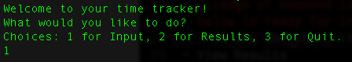
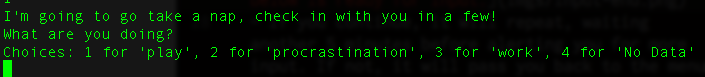
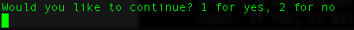
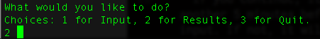

# Time Tracker

This is a command line program, meant to track productivity by capturing user responses at 5 minute intervals, listed as play (purposeful breaks), procrastination (breaks when you're really supposed to be doing something productive, come on, you know better), and work (actual productivity). These are listed as overall average stats and change from that average for the current day.

## Setup

- clone the repo here into the desired directory and cd into it using the following commands

````
git clone https://github.com/DeannaWarren/time-tracker.git
cd time-tracker
````
## Basic Use

- Start the program using the runner file.

````
ruby runner.rb
````
- Input Data
  - **from the menu:**
  - input "1" to indicate you'd like to start the input process
  
  - Go about your life. After 5 minutes, the program will use your computers sound to say "Hello" and alert you that it is ready to recieve your imput. **NOTE:** Input will create a data.csv if one is not present. User is not responsible for the creation of this file, however, deletion of the file or it's contents will remove your result data.
  
  - After you input data, it will ask if you would like to continue.
  
  - If you continue, it will repeat, waiting another 5 minutes before alerting you for more input. If not, it will pass you back to the menu. 
- View Results
  - ** from the menu: **
  - input "2" to indicate you'd like to view your results
  
  - the results will display. The percent change is in reference to the current day. It will default back to the main menu after results are calculated.
  
    

### Contact
Feel free to contact me with issues or suggestions. 

### Testing
I had some trouble getting the IO to work with tests (RSpec), which was highly disapointing because I really like testing. However, I'd like to move onto working on another project for now. I'd like to come back and figure this out. Open to helpful suggestions with examples. 

